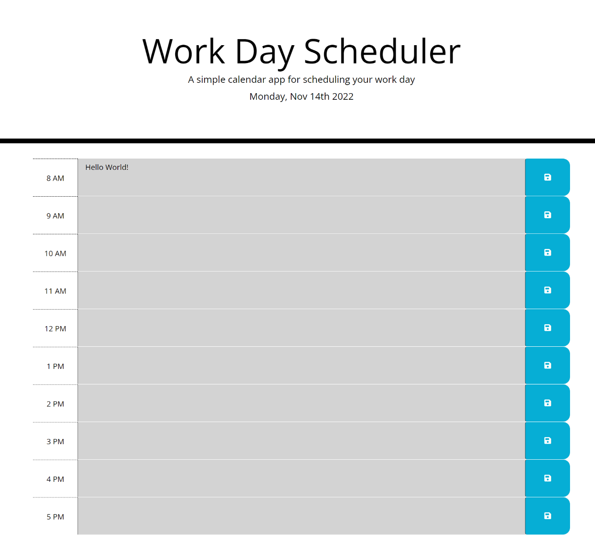

# Work-Day-Scheduler
GA Tech Coding Bootcamp - Module 5 Challenge

## Description:
 
This project is a simple calendar application that allows a user to save events for each hour of the day. This app runs in the browser and features dynamically updated HTML and CSS powered by jQuery.

## What I Learned:

Honestly, I have learned so much while working on this app- from the 'this' function to parent/child/sibling relationships.

## Link:

https://jplaisance41.github.io/Work-Day-Scheduler/

## Screenshot

